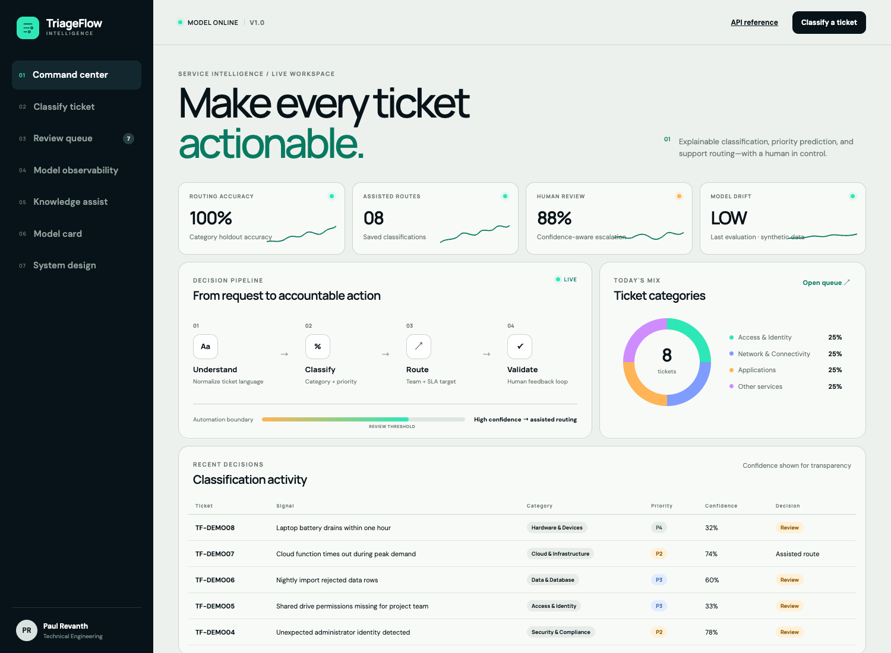
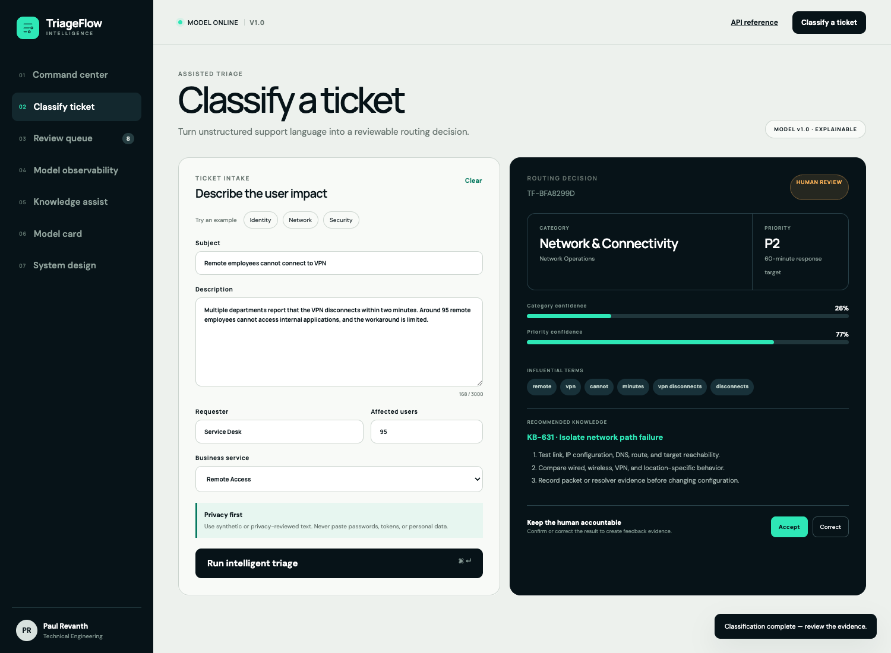
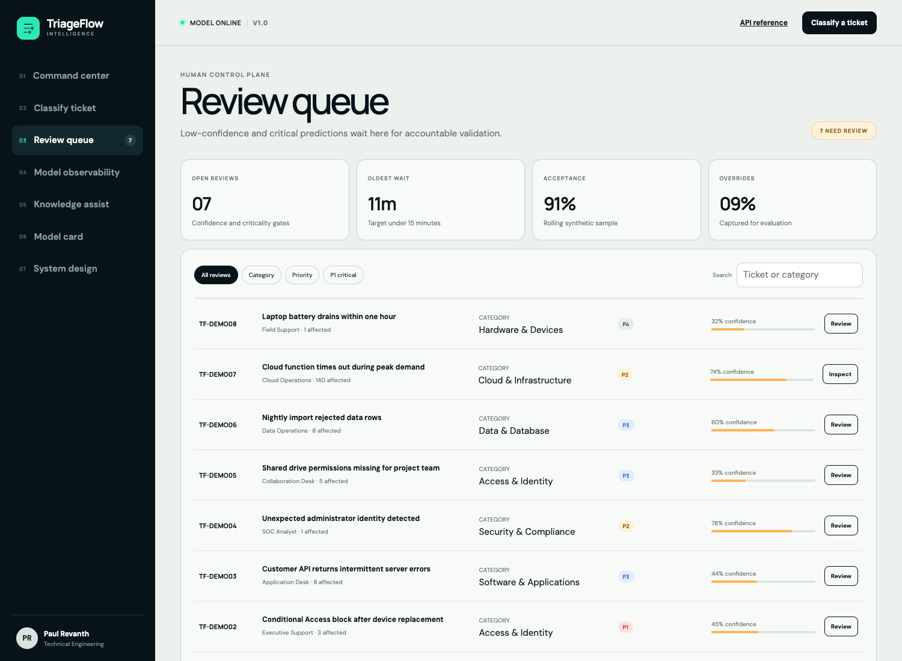
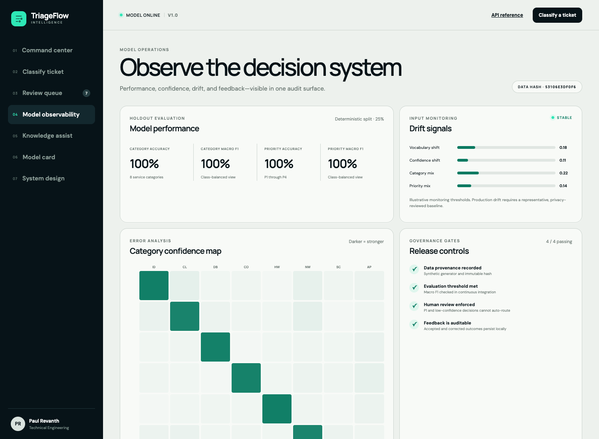
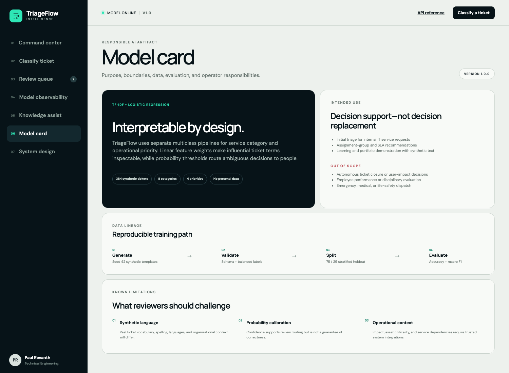
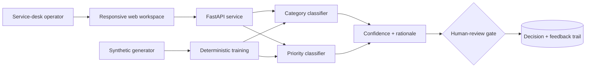

# TriageFlow Intelligence

> Explainable help-desk ticket classification, priority prediction, routing, and human review.

[](https://github.com/paulrevanthpersonal-lab/triageflow-intelligence/actions/workflows/ci.yml)
[](https://www.python.org/)
[](https://fastapi.tiangolo.com/)
[](https://scikit-learn.org/)
[](LICENSE)



## Why I built it

This repository is a modern, working reconstruction of an **Intelligent Help-Desk Ticket Classification** project I completed during my B.Tech in Computer Science. The original idea remains the same: turn unstructured support requests into consistent ticket categories, priorities, and resolver-team recommendations. This implementation rebuilds that idea as a reviewable portfolio product with reproducible data, explainable models, human oversight, tests, documentation, and a polished operator experience.

TriageFlow is deliberately separate from my [CloudAtlas SupportOS](https://github.com/paulrevanthpersonal-lab/cloudatlas-supportos) project. CloudAtlas focuses on incident operations after intake; TriageFlow focuses on the intelligence layer that understands and routes the incoming request.

## Product capabilities

- Predicts one of **8 service categories** and **4 operational priorities**
- Recommends an assignment group, SLA target, and matched knowledge article
- Shows probability, alternative labels, and influential terms for every decision
- Requires human review for all P1 and low-confidence predictions
- Records accepted and corrected outcomes in an auditable SQLite feedback trail
- Supports validated single-ticket and 25-ticket batch classification APIs
- Exposes holdout metrics, dataset hash, operational counters, and a machine-readable model card
- Includes a responsive, keyboard-friendly seven-screen service-intelligence workspace
- Ships with deterministic synthetic data, Docker, tests, linting, CI, and automated screenshots

## Experience



The interface treats machine learning as an evidence-generating assistant. The service-desk operator can inspect confidence, alternative predictions, influential phrases, routing logic, SLA target, and safe first actions before accepting or correcting the result.

| Command center | Human review queue |
|---|---|
|  |  |

| Model observability | Responsible AI model card |
|---|---|
|  |  |

## Architecture



Read the full [architecture record](docs/ARCHITECTURE.md), [model card](docs/MODEL_CARD.md), and [dataset statement](docs/DATASET.md).

## Machine-learning design

TriageFlow trains two independent scikit-learn pipelines:

1. Word and phrase features are extracted with sublinear TF-IDF over unigrams and bigrams.
2. Class-balanced logistic regression predicts either service category or priority.
3. Class probabilities drive alternatives and the human-review policy.
4. Positive linear feature contributions provide influential rationale terms.

The committed generator produces **384 privacy-safe synthetic tickets**, balanced across the eight categories and four priorities. With seed 42 and the stratified 75/25 split, both pipelines score **1.00 macro F1 on this synthetic holdout**. That result demonstrates that the implementation learns the generated taxonomy; it is **not** an estimate of production accuracy. Real deployment requires representative privacy-reviewed tickets, calibration, bias testing, and ongoing evaluation.

## Technology stack

| Layer | Technology |
|---|---|
| Machine learning | scikit-learn, TF-IDF, logistic regression, NumPy, joblib |
| API | Python, FastAPI, Pydantic, OpenAPI |
| Persistence | SQLite with parameterized SQL |
| Product UI | Semantic HTML, responsive CSS, JavaScript |
| Quality | Pytest, Ruff, compile checks, deterministic evaluation |
| Delivery | Docker, Docker Compose, GitHub Actions |
| Visual evidence | Playwright screenshot automation, desktop and mobile |

## Quick start

```bash
python3 -m venv .venv
source .venv/bin/activate
pip install -e '.[dev]'
python scripts/generate_dataset.py
uvicorn app.main:app --reload
```

Open [http://localhost:8000](http://localhost:8000). Interactive API documentation is available at [http://localhost:8000/docs](http://localhost:8000/docs).

## Docker

```bash
docker compose up --build
```

The service runs as an unprivileged user and exposes a health check at `/health`.

## API example

```bash
curl -X POST http://localhost:8000/api/classify \
  -H 'Content-Type: application/json' \
  -d '{
    "subject": "Remote office cannot resolve internal DNS",
    "description": "An entire office cannot resolve internal services and no workaround exists.",
    "requester": "Service Desk",
    "affected_users": 140,
    "business_service": "Corporate Network"
  }'
```

See the [API guide](docs/API.md) for all endpoints and response semantics.

## Validation

```bash
make check
```

The suite covers service health, input validation, category routing, priority behavior, explanations, feedback persistence, batch limits, queue evidence, model-card boundaries, OpenAPI routes, and model quality floors. GitHub Actions repeats the checks on every push and pull request.

## Screenshot automation

```bash
pnpm install
make screenshots
```

The capture workflow starts the real application with an isolated database and produces ten repeatable product states:

1. [Command center](docs/screenshots/01-command-center.png)
2. [Ticket intake](docs/screenshots/02-classify-ticket.png)
3. [Classification result](docs/screenshots/03-classification-result.png)
4. [Human review queue](docs/screenshots/04-review-queue.png)
5. [Model observability](docs/screenshots/05-model-observability.png)
6. [Knowledge assist](docs/screenshots/06-knowledge-assist.png)
7. [Model card](docs/screenshots/07-model-card.png)
8. [System design](docs/screenshots/08-system-design.png)
9. [Mobile command center](docs/screenshots/09-command-center-mobile.png)
10. [Mobile classifier](docs/screenshots/10-classifier-mobile.png)

## Responsible-use boundary

This is a portfolio and learning implementation using synthetic data. It does not contain TCS, university, employee, or customer records. It must not be used for autonomous ticket closure, employee evaluation, emergency dispatch, or production processing of credentials and unapproved personal information. Review [security and privacy notes](docs/SECURITY.md) before adapting the project.

## Documentation

- [Architecture](docs/ARCHITECTURE.md)
- [Model card](docs/MODEL_CARD.md)
- [Dataset and data statement](docs/DATASET.md)
- [API guide](docs/API.md)
- [Security and privacy](docs/SECURITY.md)
- [Operations runbook](docs/OPERATIONS.md)
- [Interview guide](docs/INTERVIEW_GUIDE.md)

## Repository structure

```text
app/                  FastAPI service, ML pipelines, models, and persistence
data/                 Deterministic synthetic ticket dataset
web/                  Responsive operator workspace
tests/                API, model, policy, and validation coverage
scripts/              Dataset and screenshot automation
docs/                 Architecture, model, API, security, and operations evidence
.github/workflows/     Continuous integration and model quality gate
```

## Roadmap

- Calibrated probabilities with representative privacy-reviewed data
- OIDC authentication, RBAC, and tenant-aware policy
- PostgreSQL, migrations, retention policy, and immutable audit export
- Multilingual models and spelling-robust evaluation sets
- Service catalog, CMDB, and ticket-platform connectors
- Model registry, drift baselines, controlled retraining, and rollback

## License

Released under the [MIT License](LICENSE).
