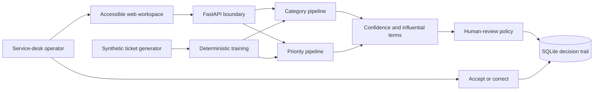

# Architecture

## Context

TriageFlow Intelligence is a single-service portfolio implementation that keeps the complete machine-learning decision path inspectable. The browser workspace, typed API, model pipelines, generated dataset, evaluation results, and local feedback store are versioned together for reproducibility.

## Responsibilities

| Component | Responsibility | Production evolution |
|---|---|---|
| Web workspace | Intake, decision evidence, review queue, observability | SSO, RBAC, design-system package |
| FastAPI service | Validation, orchestration, typed contract | Tenant isolation, rate limits, async workers |
| ML pipelines | Category and priority probabilities | Calibrated models, registry, online evaluation |
| SQLite | Local classification and feedback evidence | PostgreSQL, migrations, retention policies |
| Synthetic generator | Reproducible privacy-safe training sample | Approved historical dataset with governance |

## Key decisions

1. **Separate category and priority models.** Different labels, thresholds, and failure costs remain independently testable.
2. **Linear explainability.** TF-IDF with logistic regression exposes influential terms without an external explanation service.
3. **Human-review policy in the product boundary.** Every P1 and low-confidence result is visibly held for review.
4. **No hidden production claim.** The repository is a working reconstruction using synthetic data, not a deployed TCS system.
